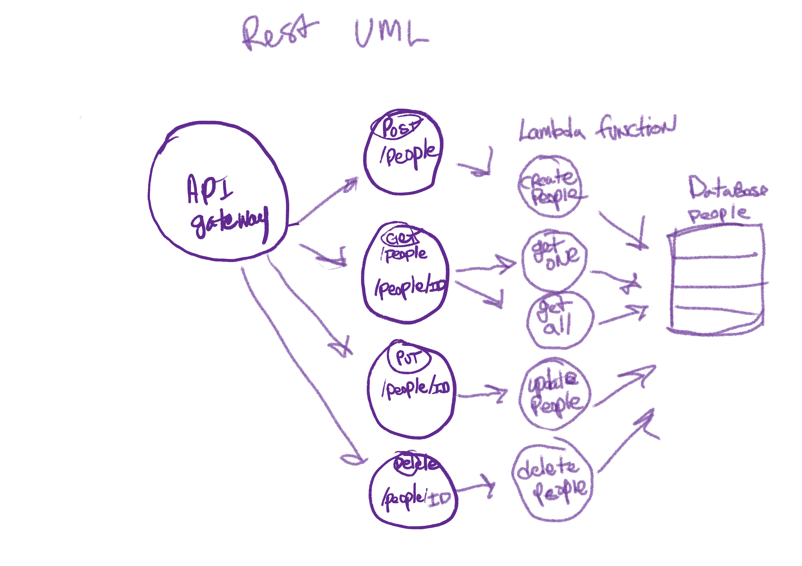

# serverless-api
# lab-18

## Author - Tek Jones
---

### Feature Tasks
Create a single resource REST API using a domain model of your choosing, constructed using AWS Cloud Services

### Database
- DynamoDB

## Routes via API Gateway

### POST
  /people
    * Given a JSON body, inserts a record into the database
    * returns an object with ID

### GET
  /people
   * returns an array of objects with all people in the database

  /people/ID
   * returns an object representing on record by its ID

### PUT
  /people/ID 
  * given JSON body and a ID, updates record in database
  * returns an object with ID

### DELETE
  /people/ID 
  * given ID deletes matching record from database
  * returns an empty object

## UML

## Process

- API Gateway
  * REST API
  * Create new api 
  * name
  * create api
  * create resource
  * create method
  * lamba function
  * go to lambda

- Lambda
  * create function
  * from scratch

- API Gateway
  * find function

- Dynamodb
  * create item

- Lambda
  * configuration
  * attach new policy
  * Dynamodb full access
  * attach policy

- VS code
 * create route handler
 * zip and import into lambda

- API Gateway
  * after endpoint is finished 
  * deploy api